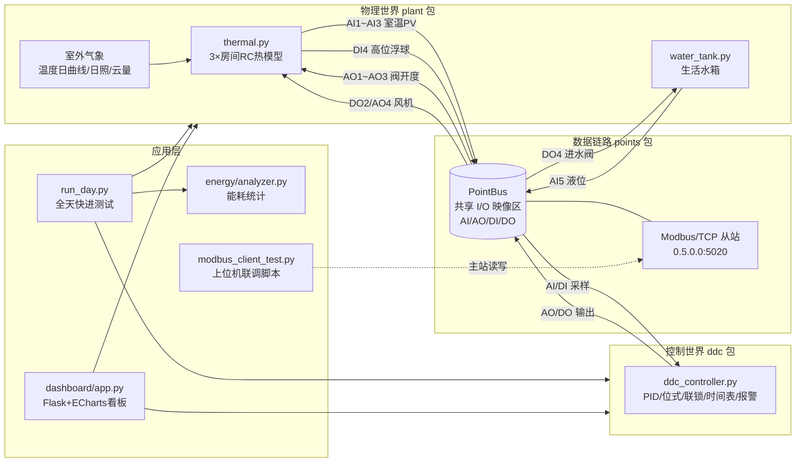
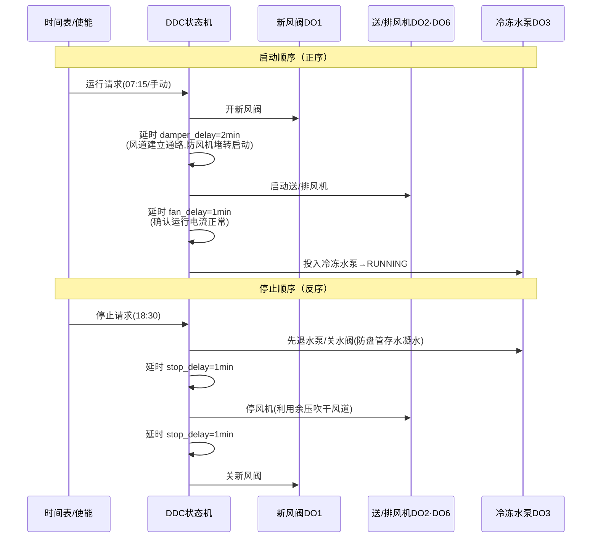

# 楼宇 DDC 控制与能源管理仿真 —— 系统设计说明书

> 本文所有指标均为**仿真验证值**。本项目不含真实传感器与执行器，
> 全部控制对象由数学模型模拟；通信协议为 Modbus/TCP（BACnet 未实现，替代方案见 README）。

---

## 1. 系统总体架构



**设计原则：与真实 BA 工程同构**

| 真实工程 | 本项目对应实现 |
| --- | --- |
| 温度传感器 4-20mA 接入 DDC 端子 | `plant` 把测量值写入 `PointBus` 的 AI 区 |
| DDC 扫描周期(0.1~1s)循环运算 | `DDCController.scan()` 每仿真分钟执行一次 |
| 继电器/0-10V 驱动执行器 | `PointBus` 的 DO/AO 区被 `plant` 读取 |
| 上位机经 BACnet/Modbus 访问控制器 | `modbus_client_test.py` 经 Modbus/TCP 读写同一映像区 |
| 时间表/设定值从上位机下发 | HR16~HR19 寄存器在线写 SP，DDC 下周期生效 |

---

## 2. 房间 RC 热网络模型原理（thermal.py）

### 2.1 数学模型

每个房间等效为**一个集中热容节点 C + 一条围护结构热阻 R** 的一阶 RC 网络：

```
C · dT/dt = (T_out − T)·UA + Q_people + Q_equip + Q_solar − Q_cool
```

- `C`：等效热容 J/K（空气+家具+围护结构，取 2.0~4.0×10⁶）；
- `UA = 1/R`：围护结构综合传热系数 W/K（决定房间与室外的耦合强度）；
- 时间常数 **τ = C/UA ≈ 3~5 小时**，与真实空调房间的实测数量级一致；
- 离散化：显式欧拉法，步长 Δt = 60s（远小于 τ，数值稳定）。

### 2.2 负荷项

| 负荷 | 模型 | 参数 |
| --- | --- | --- |
| 室外温度 | 正弦日曲线（谷值约05:00、峰值约14:00，日较差 10~13℃）+ 缓变随机游走 ±0.8℃ | 基准 25.5~27.5℃ |
| 人员显热 | 作息时间表 → 人数 × 120W（含到岗率±1人抖动） | 办公8人/会议10·6人/大堂6~10人 |
| 设备 | 时间表开关：办公 900W、会议 350W、大堂 500W | 夜间保留 5~15% 基础负荷 |
| 日照得热 | 以 13:00 为中心的高斯钟形曲线 × 云量系数(0.75~1.10) × 最大得热 | 峰值 1.5~4.2kW |
| 空调冷量 | `OP% × Q_max × 风机频率比`，风机停转则冷量为零（与联锁联动） | Q_max=6/5/12 kW |

### 2.3 测量环节

真实温度叠加高斯白噪声 N(0, 0.15℃) 模拟传感器；支持注入三类故障：
`nan`(开路)、`stuck`(卡死)、`offset`(漂移)，用于验证 DDC 报警与输出保持逻辑。

### 2.4 对象特性对整定的意义

开度每变化 1%，房间稳态温度变化约 0.35~0.43K（过程增益 K=Q_max/UA/100）；
短时间尺度上对象近似积分环节（速率约 0.0014~0.0018 K/(min·%)）。
这两个数字是第 3 章 PID 整定的直接依据。

---

## 3. 回路控制设计

### 3.1 空调温度回路：PID + 死区

**为什么用 PID**：房间温度要求连续、平稳地维持在设定值附近，需要连续调节
水阀开度以匹配随时波动的负荷——这是典型的定值调节回路，PID 是行业标准做法。

**死区（±1℃）的三段逻辑**：

```
PV < SP−1℃  ：阀全关，积分复位      （防过冷）
SP−1℃≤PV≤SP+1℃：保持原开度          （噪声死区，防止测量噪声引起阀频繁动作）
PV > SP+1℃  ：PID 连续调节          （制冷拉回设定值）
```

**整定过程（仿真验证值）**：按第 2.4 节的对象特性，取积分时间 Ti=Kp/Ki≈20min。
初版参数 Kp=6、Ki=0.08 时，早晨负荷爬坡阶段积分补充稳态开度需要 3 小时以上，
室温长期滞留在 26~28℃，舒适满足率仅 35%~54%；将参数调整为
**Kp=22、Ki=1.0、Kd=15**（大堂 Kp=18、Ki=0.8、Kd=18）后，
负荷突变后约 15~30 分钟内恢复设定值，工作时间舒适满足率提升至 **90.7%~95.5%（仿真验证值）**。
配合早晨预冷（06:50 启动系统、预冷目标 SP−1℃），消除了上班后的惯性超温。

**抗积分饱和**：输出到达 0/100% 限幅且偏差仍同向时冻结积分，
避免长时间饱和后退饱和引起的大幅超调。

### 3.2 水箱液位回路：位式控制 + 大回差

**为什么不用 PID 用位式**：液位只需保持在区间内（1.0~1.8m），无需精确恒定；
进水阀只有开/关两种状态。位式控制结构最简单、成本最低，是此类对象的正确选型。

**回差（滞环）设计**：

```
液位 ≤ 1.00m (下限)   → 开进水阀
1.00m < 液位 < 1.80m  → 保持原状态     ← 回差带 0.8m
液位 ≥ 1.80m (上限)   → 关进水阀
DI4 高位浮球 = 0      → 强制关阀（硬件限位优先于程序）
```

**回差设小的后果（面试高频题）**：若回差只有几厘米，充放水周期缩短到几分钟，
进水阀每小时启停数十次——电磁阀线圈过热烧毁、水锤噪音、机械磨损加剧。
回差 0.8m 时仿真全天阀门仅动作 3~5 次（运行日报：液位范围 0.94~1.89m，仿真验证值）。
工程经验：回差一般取量程的 30%~50%，兼顾设备寿命与液位波动范围。

---

## 4. 联锁逻辑设计（风机启动顺序）

### 4.1 启动/停止时序图



**为什么要延时（面试高频题）**：
新风阀从全关到全开有行程时间（电动风阀典型 60~120s），若风机先于阀门开启，
风道处于堵塞状态，风机将在接近零流量工况下启动——电流冲击大、易跳闸，
风压还会把软连接吹鼓甚至撕裂。投泵延时的目的则是确认风机已建立稳定风量后
再引入冷源，避免盘管在无风工况下结露甚至冻裂。安全联锁则相反：
防火阀关闭信号必须**无延时立即停机**——火灾工况下每一秒都在向烟气区送风。

### 4.2 防火阀联锁（最高优先级）

```
IF DI1 == 0 (防火阀关闭):
    立即: 停送/排风机 + 停冷冻水泵 + 关新风阀 + 关水阀(AO=0)
    产生"重要"级报警并锁定启动(防止火情反复重启)
    DI1 恢复后解锁, 时间表自动重新走启动序列
```

仿真验证（运行日报）：15:00 注入防火阀关闭 → 1 个扫描周期内完成全部停机动作；
15:12 信号复位 → 机组经正序自动恢复运行，联锁动作次数 1 次/天（仿真验证值）。

### 4.3 时间表与 setback

| 时段 | 节能模式开 | 节能模式关 |
| --- | --- | --- |
| 06:50~08:00 | 系统启动+预冷(SP−1℃) | 全天恒温 24℃ |
| 08:00~18:00 | SP=24℃ | SP=24℃ |
| 18:00~18:30 | SP=28℃ 过渡 | SP=24℃ |
| 夜间 | 系统**停机**，室温自由漂移；若 PV>29.5℃ 自动投入保护制冷至 28℃ | 连续供冷 |

上位机可对任一房间写手动 SP（Modbus HR16~18 + 使能位 HR19），手动值优先于时间表。

---

## 5. Setback 节能原理（面试高频题）

夜间把设定温度从 24℃ 放宽到 28℃ 并停机的节能来源有三层：

1. **减小室内外温差**：围护结构传热负荷 ∝ (T_out − T_in)。夜间 T_out≈22~25℃，
   维持 24℃ 与维持 28℃ 相比，温差驱动的净热负荷成倍增加；放宽 SP 后大部分时段
   冷负荷自然为零，无需开机；
2. **利用建筑蓄冷**：白天预冷的围护结构冷量在夜间缓慢释放，室温漂移速度仅
   0.02~0.05K/min，到次日 06:50 也只升到 27~29℃，预冷 70 分钟即可拉回舒适区；
3. **设备间歇**：风机+水泵停机直接省去输配能耗（本仿真中风机按相似定律
   P∝f³ 计），这部分占基准总能耗的一半以上——输配能耗从 217.73 kWh 降到
   104.42 kWh，其中风机从 182.23 kWh 降到 87.39 kWh（仿真验证值）。

仿真结果：节能率 **36.8%**（354.18 → 224.00 kWh/天，仿真验证值）。

---

## 6. 点表设计依据（point_table.py）

### 6.1 编号惯例

按 BA 行业惯例以**点类型 + 序号**编址：AI1~AI6 / AO1~AO4 / DI1~DI4 / DO1~DO6，
与真实 DDC 控制器端子排命名一致，图纸—点表—程序三者可直接对照。

### 6.2 完整点表

| 地址 | 类型 | 中文描述 | 单位 | Modbus 映射 | 读/写 |
| --- | --- | --- | --- | --- | --- |
| AI1 | AI | 办公室室内温度 | ℃ | IR fc04 @0x0000, ×10 | R |
| AI2 | AI | 会议室室内温度 | ℃ | IR fc04 @0x0001, ×10 | R |
| AI3 | AI | 大堂室内温度 | ℃ | IR fc04 @0x0002, ×10 | R |
| AI4 | AI | 室外温度 | ℃ | IR fc04 @0x0003, ×10 | R |
| AI5 | AI | 生活水箱液位 | m | IR fc04 @0x0004, ×100 | R |
| AI6 | AI | 冷冻水供水温度 | ℃ | IR fc04 @0x0005, ×10 | R |
| AO1~AO3 | AO | 各房间冷冻水阀开度 | % | HR fc03/06 @0x0000~2, ×10 | R/W |
| AO4 | AO | 送风机运行频率 | Hz | HR fc03/06 @0x0003, ×10 | R/W |
| DI1 | DI | 防火阀关闭信号(0=联锁) | - | DI fc02 @0x0000 | R |
| DI2 | DI | 手/自动转换开关(1=自动) | - | DI fc02 @0x0001 | R |
| DI3 | DI | 送风机故障反馈(1=正常) | - | DI fc02 @0x0002 | R |
| DI4 | DI | 水箱高位浮球(1=未到高位) | - | DI fc02 @0x0003 | R |
| DO1 | DO | 新风阀开关 | - | CO fc01/05 @0x0000 | R/W |
| DO2 | DO | 送风机启停 | - | CO fc01/05 @0x0001 | R/W |
| DO3 | DO | 冷冻水泵启停 | - | CO fc01/05 @0x0002 | R/W |
| DO4 | DO | 水箱进水阀开关 | - | CO fc01/05 @0x0003 | R/W |
| DO5 | DO | 声光报警器 | - | CO fc01/05 @0x0004 | R/W |
| DO6 | DO | 排风机启停(与送风联动) | - | CO fc01/05 @0x0005 | R/W |
| — | — | 手动SP1~SP3 | ℃ | HR @0x0010~12, ×10 | R/W |
| — | — | SP手动使能位 bit0~2 | - | HR @0x0013 | R/W |
| — | — | 模式字(bit0节能/bit1自动) | - | HR @0x0014 | R/W |

### 6.3 设计考虑

- **模拟量定点化**：Modbus 寄存器只有 16 位整数，温度按 0.1℃ 分辨率 ×10 存储，
  液位 ×100（1cm 分辨率），与真实 DDC 工程量化方式一致；
- **故障哨兵值**：传感器开路时寄存器写 32767，读取方据此还原 NaN 并触发报警，
  模拟真实系统"坏值识别"；
- **读写分离**：AI/DI 为只读区（物理侧驱动），AO/CO 可写（遥控）；SP 区独立编址，
  实现"设定值在线修改"而不干扰过程数据。

## 7. 报警体系

| 报警 | 触发条件 | 级别 | 附加动作 |
| --- | --- | --- | --- |
| 传感器故障 | PV=NaN 或超出 [-20, 60]℃ | 重要 | 该回路输出保持，禁止调节 |
| 高温报警 | PV > 28℃ 持续 5 分钟（去抖） | 警告 | 声光报警器 DO5 |
| 低温报警 | PV < 20℃ | 警告 | 声光报警器 DO5 |
| 防火阀联锁 | DI1 = 0 | 重要 | 立即停风机/水泵，锁定重启 |
| 水箱溢流风险 | 液位 ≥ 1.90m | 重要 | 浮球硬限位已强制关阀 |
| 水箱低液位 | 液位 ≤ 0.20m | 警告 | 提示检查供水 |
| 风机故障 | DI3 = 0 且系统启动中 | 重要 | 禁止投入冷冻水泵 |

报警进入队列（时间/级别/来源/内容），活动报警去重、条件消失自动复位允许再报。

## 8. 能耗计量方法

- 冷量能耗：E = Σ(Q_cool · Δt)/3.6e6，Δt=60s，Q_cool 来自 RC 模型物理计算
  （等价于理想冷量计）；
- 风机：P = P_rated·(f/50)³（相似定律），送风 5.5kW + 排风 2.2kW；
- 水泵：额定 1.5kW × 运行时间；
- 策略对比：同一随机种子、同一事件注入时刻分别跑"节能开/关"，保证可比性。
